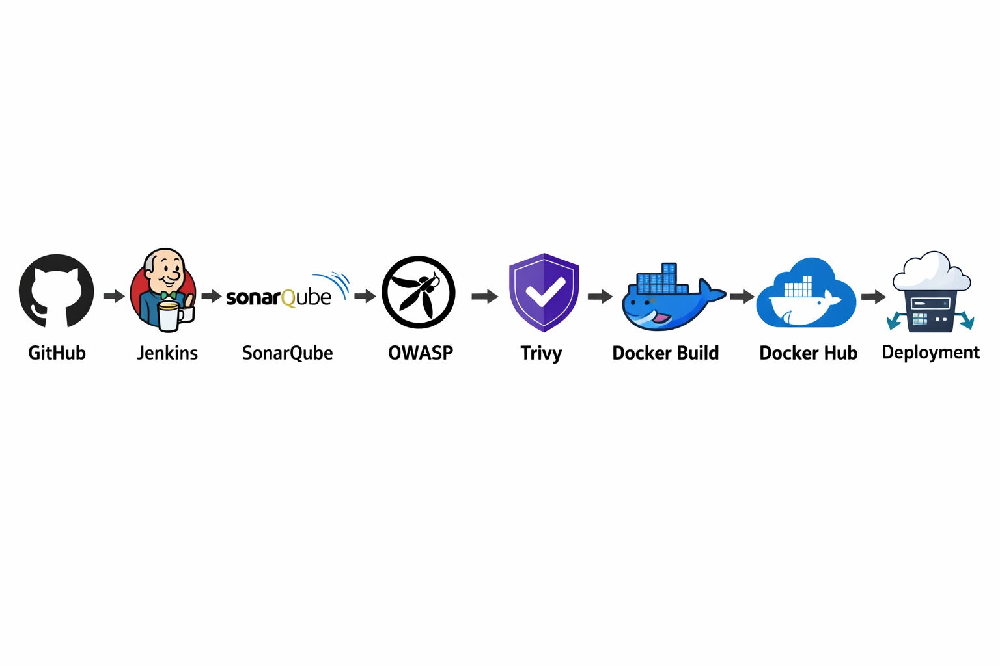
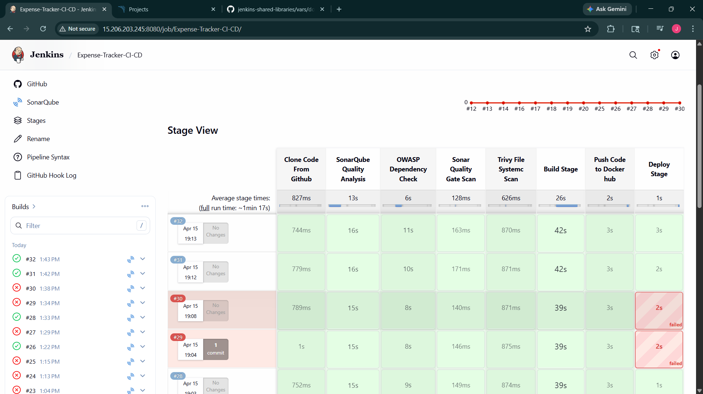
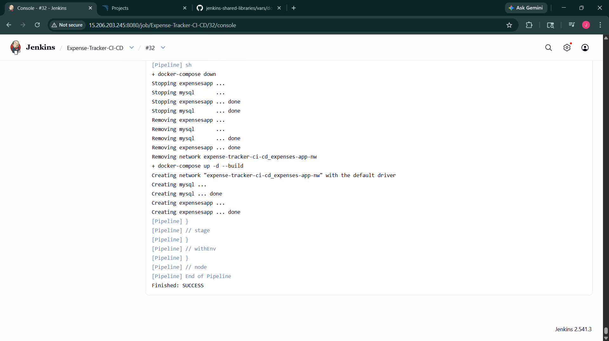
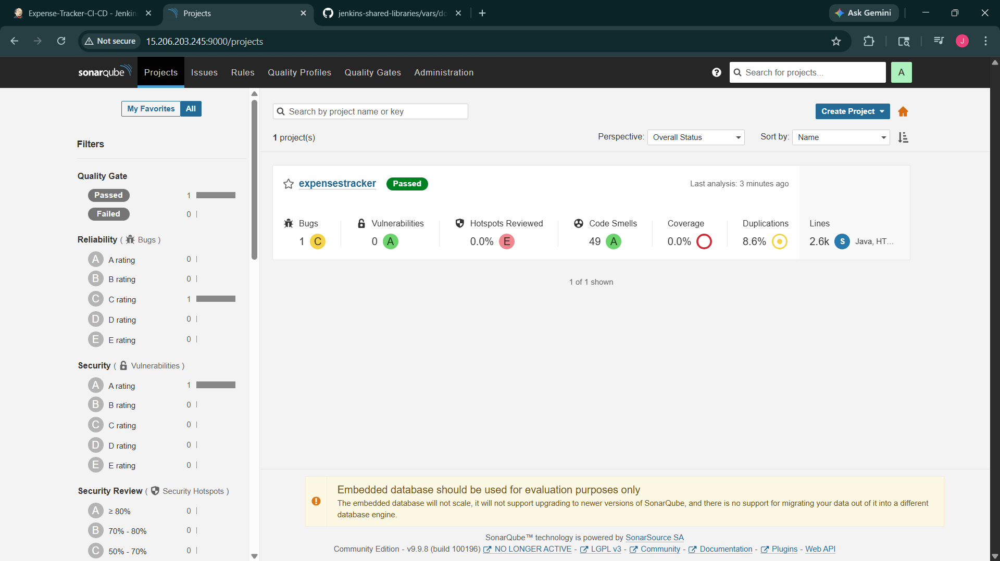
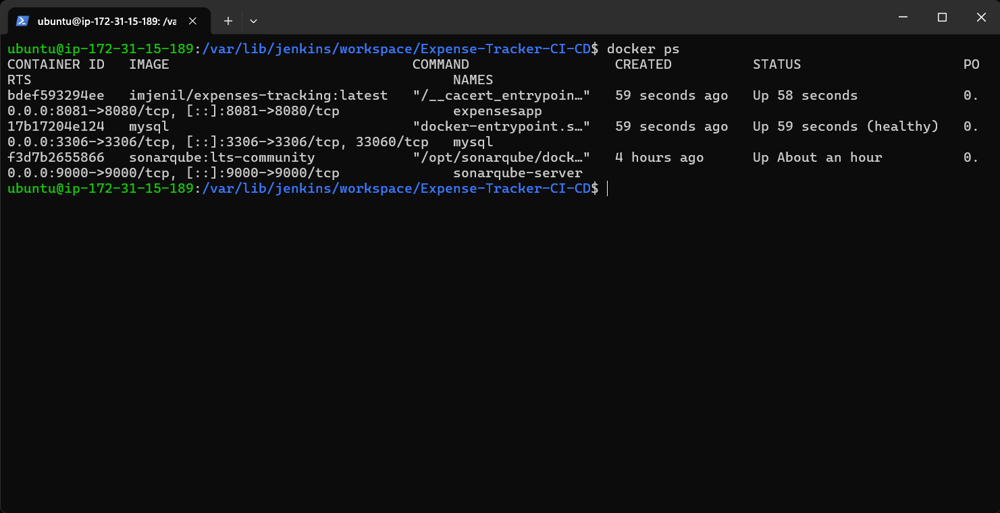
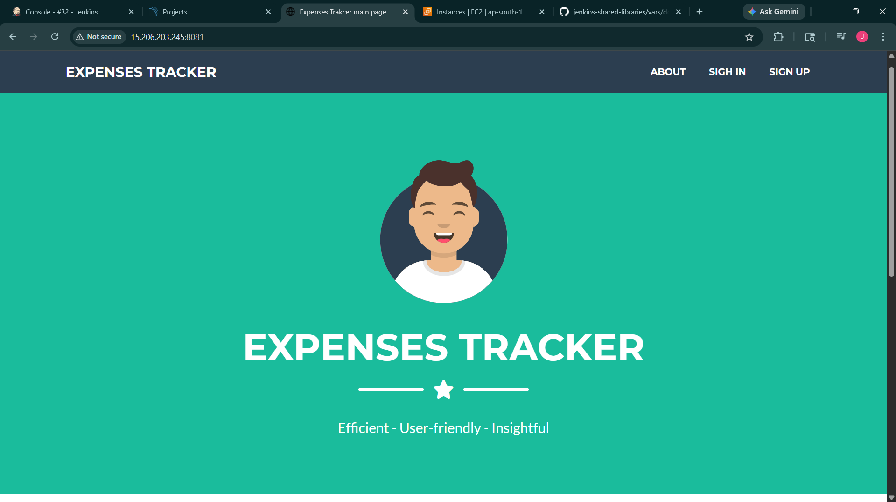

# Expense Tracker CI/CD Project

## 🚀 Overview
This project is a **Expense Tracker Web Application** enhanced with a complete **CI/CD pipeline using Jenkins**.

It demonstrates real-world DevOps practices including:
- Automated build and deployment  
- Code quality analysis (SonarQube)  
- Security scanning (OWASP & Trivy)  
- Containerization using Docker  

---

## 🧱 Tech Stack

### Backend
- Java  
- Spring Boot  
- Spring MVC  
- Spring Security  
- Spring Data JPA  

### Frontend
- Thymeleaf  
- Bootstrap  

### Database
- MySQL  

### DevOps / CI-CD
- Jenkins Pipeline  
- SonarQube  
- OWASP Dependency Check  
- Trivy  
- Docker & Docker Compose  

---

## 🔄 CI/CD Pipeline Flow



---

## ⚙️ Features

- 🔐 User Authentication & Authorization  
- 📊 Expense CRUD Operations  
- 🔍 Filtering & Expense Analysis  
- 🛡️ Security scanning with OWASP & Trivy  
- 📦 Dockerized application  
- 🔄 Automated CI/CD pipeline  

---

## 📸 CI/CD Proof

### ✅ Jenkins Pipeline


### 📜 Build Logs


### 📊 SonarQube Analysis


### 🐳 Running Containers


### 🌐 Application Running


---

## 🛠️ Getting Started

### 1. Clone Repository
git clone 
```bash
https://github.com/imJENIL/Expenses-Tracker-WebApp.git
```
### 2. 🐳 Run with Docker (Recommended)

Make sure Docker and Docker Compose are installed.

### 3. Start Application
```bash
docker-compose up -d --build
```
### 4. Access Application
http://localhost:8081

### 5. 🛑 Stop Application
```bash
docker-compose down
```
---

## 🎯 What This Project Demonstrates

- End-to-end CI/CD pipeline implementation  
- Integration of multiple DevOps tools  
- Secure application deployment workflow  
- Real-world project structure  

---

## 🙏 Acknowledgment

This project builds upon work from the following repositories:

- Original Application:  
  👉 https://github.com/mohamed0sawy/Expenses-Tracker-WebApp  

- Docker Implementation Reference:  
  👉 https://github.com/sneh-create/Expenses-Tracker-WebApp  

CI/CD pipeline integration, enhancements, and deployment setup were implemented by **Jenil Patel**.

---

## 👨‍💻 Author

**Jenil Patel**

---

## 📄 License
This project is licensed under the MIT License.
